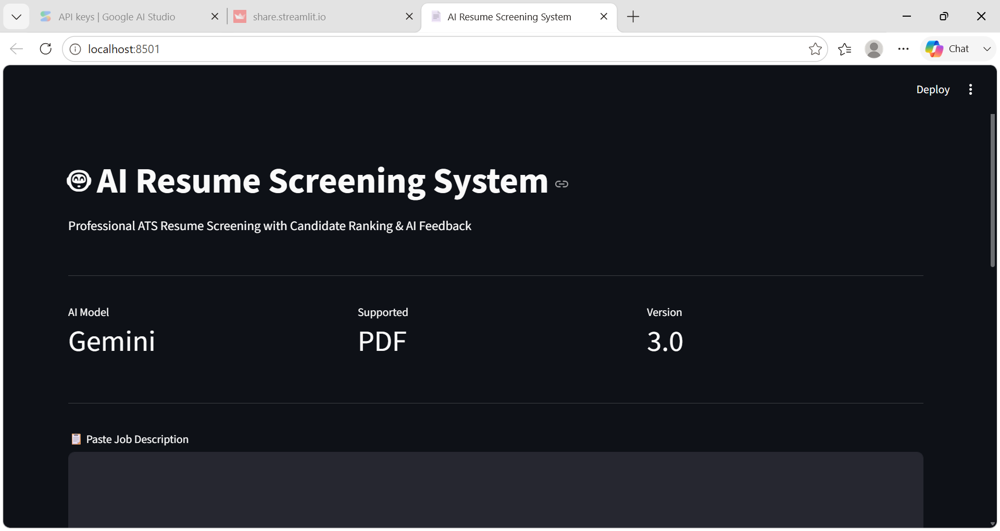
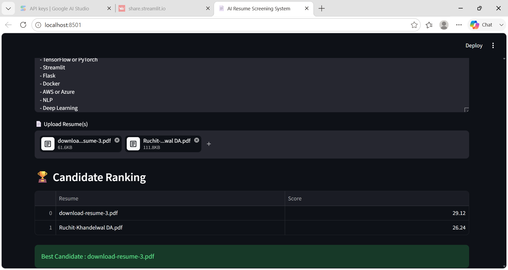
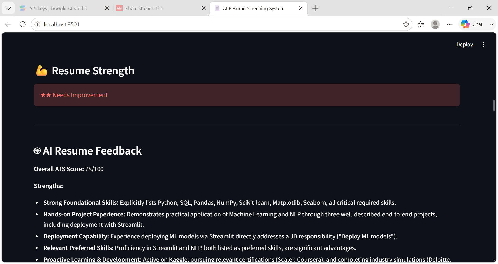
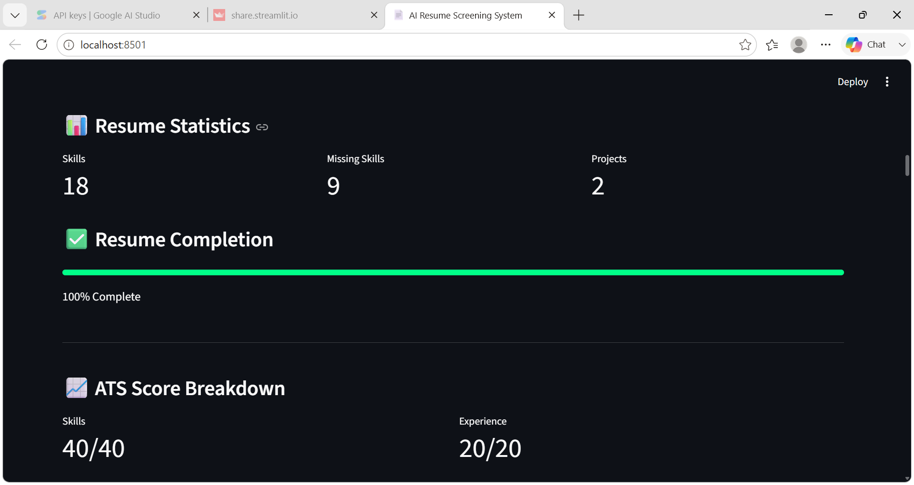
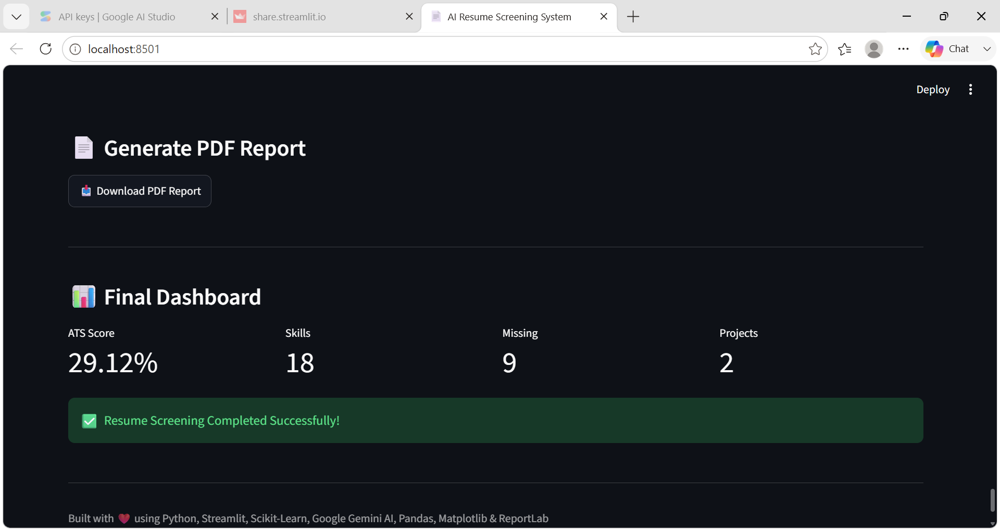

# 🤖 AI Resume Screening System

An AI-powered Resume Screening Application built using Python, NLP, Sentence-Transformers, and Google Gemini — designed to help recruiters (or job seekers checking their own resume) instantly evaluate and rank resumes against a job description.

## ✨ Features

- 📄 **Multi-Resume Upload** — screen and rank multiple PDF resumes against one job description at once
- 🧠 **Semantic Match Scoring** — uses Sentence-Transformers embeddings (not just keyword overlap) to understand _meaning_, so phrasing differences between a resume and JD don't unfairly hurt the score
- 🛠 **Skill Extraction** — detects 70+ technical and soft skills across programming, ML/AI, web dev, databases, cloud/DevOps, and BI tools, including common aliases (e.g. "ML" = "Machine Learning", "React.js" = "React")
- 🏆 **Candidate Ranking** — automatically ranks all uploaded resumes and highlights the best match
- 🤖 **AI Resume Feedback (Gemini)** — strengths, weaknesses, missing skills, resume improvement tips, recruiter decision, and interview questions — generated in a single efficient API call
- 📊 **Visual Dashboard** — ATS score breakdown, resume completion meter, skill distribution chart
- 📥 **PDF Report Export** — download a clean summary report for any screened candidate
- 🌑 **Dark Theme UI**

## 🧩 How Scoring Works

1. **Semantic similarity** (Sentence-Transformers, `all-MiniLM-L6-v2`) compares the resume and job description at the meaning level, not just word-for-word — falls back automatically to TF-IDF cosine similarity if the model is unavailable.
2. **Skill overlap** is calculated separately using a 70+ skill taxonomy, showing exactly which required skills are present or missing.
3. **Gemini AI** provides a qualitative second opinion — strengths, weaknesses, and a recruiter-style shortlist/reject decision.

## 🖼 Screenshots

### Home



### Candidate Ranking



### Resume Feedback



### Resume Statistics



### PDF Report



## 🛠 Technologies Used

- Python
- Streamlit
- Sentence-Transformers
- Scikit-Learn
- Google Gemini API
- PDFPlumber
- Pandas
- Matplotlib
- ReportLab

## 🚀 Installation

```bash
pip install -r requirements.txt
streamlit run app.py
```

You'll also need a Gemini API key set in `.streamlit/secrets.toml`

## 📁 Project Structure

```
AI_Resume_Screener/
├── .streamlit/
│   ├── config.toml         # Streamlit app theme/config
│   └── secrets.toml         # Gemini API key (not committed — see .gitignore)
├── screenshots/
│   ├── home.png
│   ├── candidate_ranking.png
│   ├── resume_feedback.png
│   ├── resume_statstics.png
│   └── pdf_report.png
├── app.py                   # Main Streamlit application
├── resume_parser.py          # PDF text extraction, contact details, section parsing
├── skill_extractor.py        # Skill taxonomy + detection
├── ranking.py                 # Semantic (+ TF-IDF fallback) match scoring
├── requirements.txt
├── .gitignore
└── README.md
```

## 👤 Author

Vanshika Varshney
