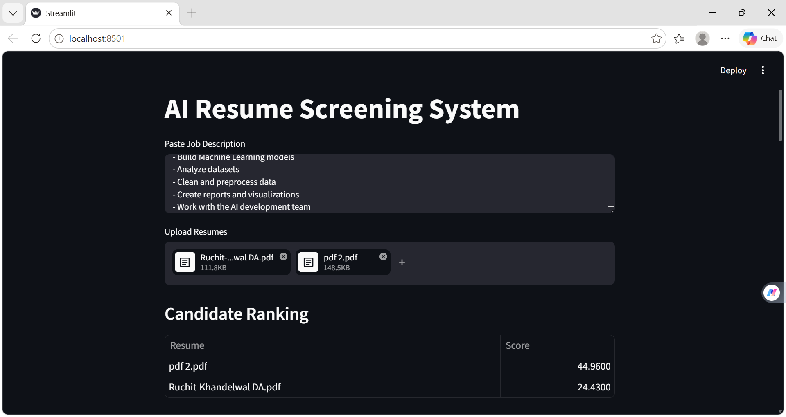
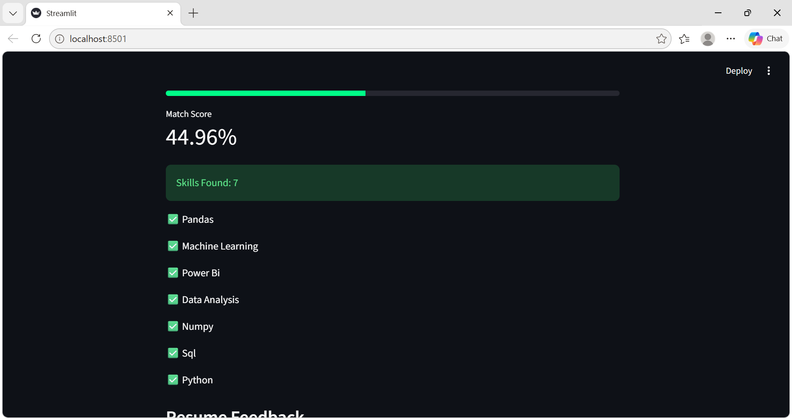
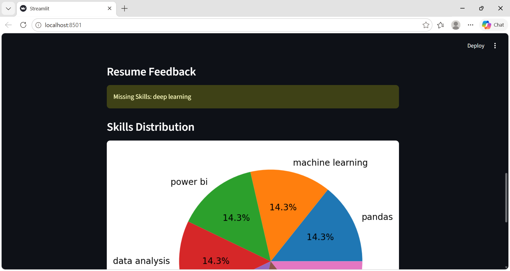
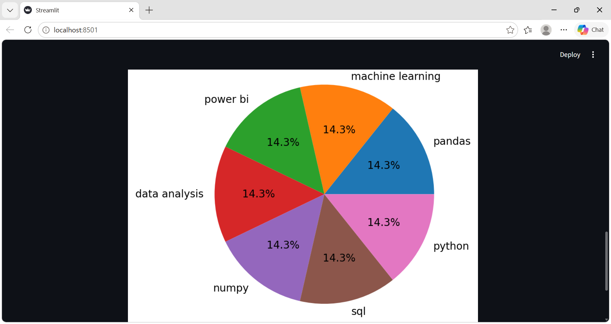

## AI Resume Screening System

An AI-powered Resume Screening Application built using Python, NLP, and Streamlit.

## Features

- Resume PDF Upload
- Skill Extraction
- Job Description Matching
- Match Score Calculation
- Resume Feedback
- Skills Visualization
- PDF Report Download
- Dark Theme UI

## Project Screenshot
### Dashboard

### Analysis
 

### Ranking

### PDF Report
 

## Technologies Used

- Python
- Streamlit
- Scikit-Learn
- PDFPlumber
- Matplotlib
- ReportLab

## Installation

pip install -r requirements.txt
streamlit run app.py

## Author

Vanshika Varshney

